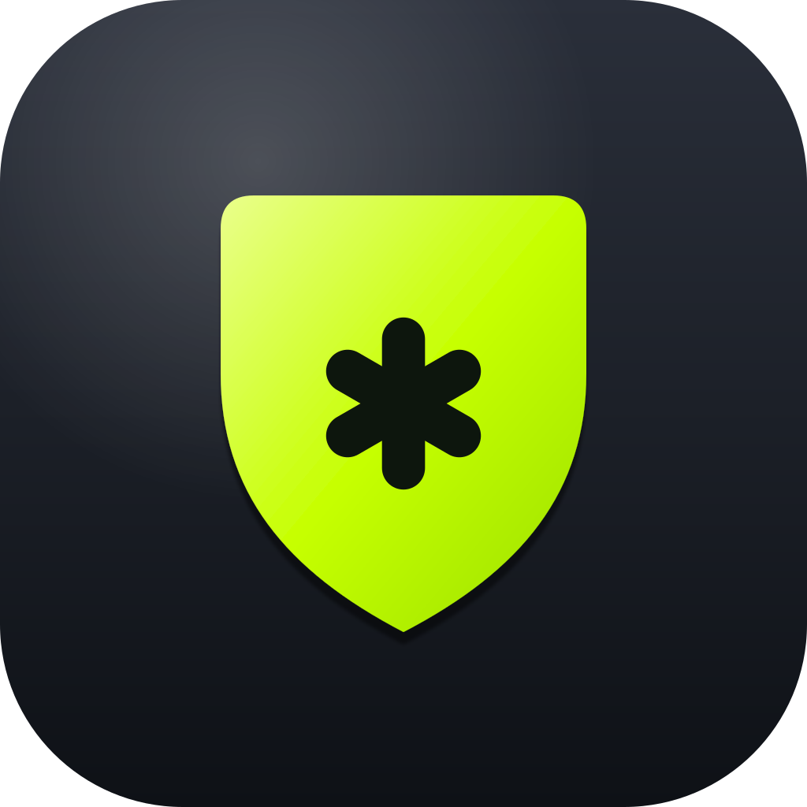

<div align="center">


<br/>

**Block spam calls by _pattern_, not just by number.**
Wildcards, prefixes, and rules — screened silently by Android before your phone ever rings.

<br/>

[](#requirements)
[](#requirements)
[](#tech)
[](LICENSE)
[](PRIVACY.md)

</div>

---

## Why Globber?

Most blockers want an exact number. Spam doesn't work that way — it rotates through
ranges, spoofs prefixes, and burns a new line every call. **Globber blocks the
*shape* of the number.**

> The name comes from **glob** patterns: you describe the numbers you want gone,
> and Globber screens every incoming call against your rules.

```
+1 800 555 ****     →  block the whole 555 block
1900*               →  kill premium-rate prefixes
*0000               →  drop sequential robo-dialers
```

<div align="center">

</div>

---

## ✨ Features

| | |
|---|---|
| 🧩 **Pattern rules** | Match by prefix, suffix, or wildcard — not just exact blacklists. |
| 🔕 **Silent screening** | Uses Android's `CallScreeningService`; blocked calls are rejected before they ring. |
| 👤 **Contacts-aware** | Optionally let known contacts through regardless of rules. |
| 📜 **Block log** | Review every screened call. |
| 🎨 **Neon-lime bento UI** | Dark theme with a custom icon set. |
| 🔒 **Fully private** | Runs 100% on-device. No network permission, no analytics, no ads. |

---

## Requirements

- **Android 10 (API 29)** or newer
- Globber must be set as the device's **call-screening app**

### Permissions

| Permission | Why |
|------------|-----|
| `READ_CONTACTS` | Allow calls from known contacts _(optional)_ |
| `POST_NOTIFICATIONS` | Notify when a call is blocked |

> No `INTERNET` permission is requested. Globber **cannot** phone home.

---

## 📦 Download

Grab the latest signed APK from the
[**Releases**](https://github.com/salahu01/call-blocker/releases/latest) page.

## 🛠 Build

```bash
git clone https://github.com/salahu01/call-blocker.git
cd call-blocker
./gradlew assembleDebug    # or assembleRelease
```

Debug output: `app/build/outputs/apk/debug/app-debug.apk`

> **Signed release builds** read credentials from a gitignored `key.properties`
> at the repo root:
> ```properties
> storeFile=/absolute/path/to/your-keystore.jks
> storePassword=…
> keyAlias=…
> keyPassword=…
> ```
> Without it, `assembleRelease` produces an unsigned APK — sign it manually:
> ```bash
> apksigner sign --ks <your-keystore> app/build/outputs/apk/release/app-release-unsigned.apk
> ```

---

## Tech

- **Kotlin** · **Jetpack Compose**
- **Room** — block-rule & log persistence
- **`CallScreeningService`** — system-level call interception
- `minSdk 29` · `targetSdk 35`

---

## 🎨 Brand

<div align="center">



</div>

| Token | Hex | |
|-------|-----|---|
| Neon lime | `#C6FF00` |  |
| Lime light | `#EAFF8C` |  |
| Lime deep | `#9BE000` |  |
| Base dark | `#0a0c07` |  |

Source artwork lives in [`branding/`](branding/) — icon, glyph, background, and banner as editable SVG.

---

## Contributing & Policies

- [Contributing](CONTRIBUTING.md)
- [Code of Conduct](CODE_OF_CONDUCT.md)
- [Security](SECURITY.md)
- [Privacy](PRIVACY.md)
- [Changelog](CHANGELOG.md)

---

<div align="center">

**[MIT](LICENSE)** © 2026 [salahu01](https://github.com/salahu01)

<sub>Made for quieter phones.</sub>

</div>
