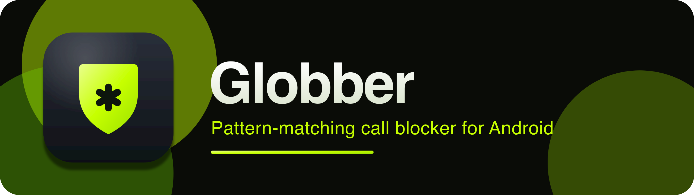

<div align="center">



<br/>
<br/>

&nbsp;
&nbsp;
&nbsp;


<br/>
<br/>

**Block spam calls by _pattern_, not just by number.**
Wildcards, prefixes, and rules — screened silently by Android before your phone ever rings.

<br/>

[](https://github.com/salahu01/call-blocker/actions/workflows/ci.yml)
[](https://github.com/salahu01/call-blocker/issues)
[](https://github.com/salahu01/call-blocker/commits)
[](LICENSE)
[](https://github.com/salahu01/call-blocker/releases/latest)

</div>

## Download

<a href="https://github.com/salahu01/call-blocker/releases/latest">

</a>

Grab the latest signed APK from the [**Releases**](https://github.com/salahu01/call-blocker/releases/latest) page.
Requires **Android 10 (API 29)** or newer, and Globber set as the device's **call-screening app**.

## Why

Most blockers want an exact number. Spam doesn't work that way — it rotates through ranges, spoofs prefixes, and burns a new line every call. **Globber blocks the *shape* of the number.**

The name comes from **glob** patterns: you describe the numbers you want gone, and Globber screens every incoming call against your rules.

```
+1 800 555 ****     →  block the whole 555 block
1900*               →  kill premium-rate prefixes
*0000               →  drop sequential robo-dialers
```

## Features

- **Pattern rules** — match by exact, starts-with, contains, ends-with, or regex; not just exact blacklists.
- **Silent screening** — uses Android's `CallScreeningService`; blocked calls are rejected before they ring.
- **Contacts-aware** — optionally let known contacts through regardless of rules.
- **Block log** — review every screened call, with day grouping, action filters and search.
- **Theming** — system / light / dark, with a neon-lime bento UI and custom icon set.
- **Backup** — export and import your rules as a JSON file.
- **Fully private** — runs 100% on-device. No `INTERNET` permission, no analytics, no ads. Globber **cannot** phone home.

## Permissions

| Permission | Why |
|------------|-----|
| `READ_CONTACTS` | Allow calls from known contacts _(optional)_ |
| `POST_NOTIFICATIONS` | Notify when a call is blocked |

<!--
## Development setup

1. Install the [Android SDK](https://developer.android.com/studio) and JDK 17.
2. Clone the repository:
   ```bash
   git clone https://github.com/salahu01/call-blocker.git
   cd call-blocker
   ```
3. Build a debug APK (debug-signed, installable):
   ```bash
   ./gradlew assembleDebug
   ```
   Output: `app/build/outputs/apk/debug/app-debug.apk`
4. For a **signed release** build, create a gitignored `key.properties` at the repo root:
   ```properties
   storeFile=/absolute/path/to/your-keystore.jks
   storePassword=…
   keyAlias=…
   keyPassword=…
   ```
   then run `./gradlew assembleRelease`. Without it, `assembleRelease` produces an unsigned APK.
-->

**Tech:** Kotlin · Jetpack Compose · Room (rule & log persistence) · `CallScreeningService` · `minSdk 29` / `targetSdk 35`.

## Contributing & policies

- [Contributing](CONTRIBUTING.md)
- [Code of Conduct](CODE_OF_CONDUCT.md)
- [Security](SECURITY.md)
- [Privacy](PRIVACY.md)
- [Changelog](CHANGELOG.md)

## License

[MIT](LICENSE) © 2026 [salahu01](https://github.com/salahu01)
